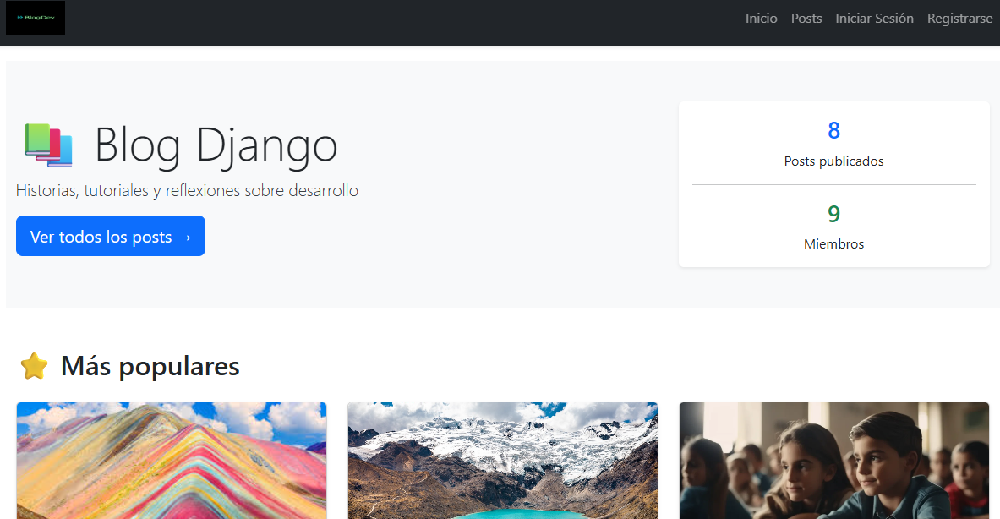
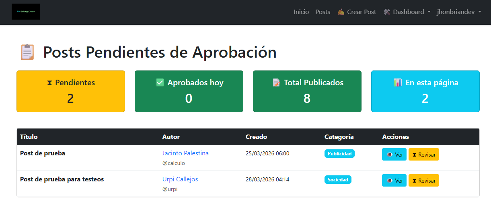
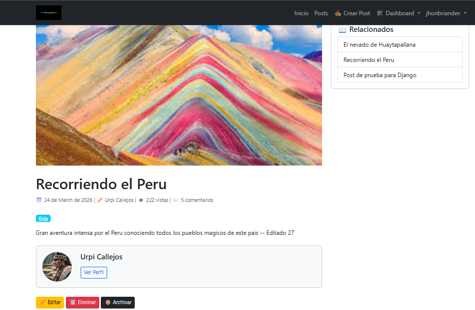

Sitio web generado con python y django denominado My Blog
Este es un proyecto dirigido por mi persona con ayuda de Inteligencia Artificial
Es un proyecto de aprendizaje, existen muchos comentarios incluidos, hechos por mi autoria
y otros realizados por los LLM, que se utilizaron para explicar, detallar y brindar valor 
agreado a los aprendizajes.

El presente proyecto busca implementar el aprendizaje obtenido acerca del framework Django, 
utilizando los principales fundamentos de Python, SQL, ademas se incorporo sintaxis de HTML, CSS Y Javascript.

Este proyecto muestra un blog interactivo, accesible desde la web, no es necesario logearse para visualizar el contenido.
sin embargo si deseas participar podrias registrarte, y en breve tus publicaciones y comentarios seran aprobados.

Puedes visitar el sitio aqui: https://my-blog-z6ya.onrender.com/

# Blog Django — Proyecto Portafolio

Blog completo desarrollado con Django 4.2+ como proyecto de portfolio.

## Características principales

- Sistema de roles: Admin, Moderador, Usuario
- CRUD de posts con flujo de aprobación (borrador → publicado → archivado)
- Sistema de comentarios con hilos de respuesta y moderación
- Notificaciones por email automáticas
- API REST con Django REST Framework
- Autenticación de usuarios completa

## Tecnologías

- Python 3.11 / Django 4.2
- PostgreSQL
- Django REST Framework
- Bootstrap 5
- pytest / pytest-django

## Instalación local

1. Clona el repositorio:
```bash
   git clone https://github.com/tu-usuario/tu-repo.git
   cd tu-repo
```

2. Crea y activa el entorno virtual:
```bash
   python -m venv venv
   source venv/bin/activate  # Linux/Mac
   venv\Scripts\activate     # Windows
```

3. Instala las dependencias:
```bash
   pip install -r requirements.txt
```

4. Crea el archivo `.env` en la raíz con las siguientes variables:
```
   SECRET_KEY=genera-una-clave-aqui
   DEBUG=True
   DB_NAME=nombre_bd
   DB_USER=usuario
   DB_PASSWORD=contraseña
   DB_HOST=localhost
   DB_PORT=5432
```

5. Aplica las migraciones:
```bash
   python manage.py migrate
```

6. Crea un superusuario:
```bash
   python manage.py createsuperuser
```

7. Ejecuta el servidor:
```bash
   python manage.py runserver
```

## Screenshots del Blog

Vista principal del Blog



Vista de dashboard del administrador



Vista detallada de las publicaciones, con opciones de edicion y eliminacion
ademas permite comentarios y respuestas a comentarios.



